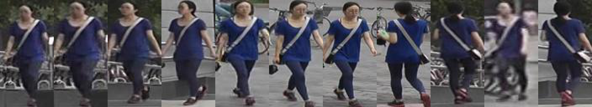

# A Tiny Person ReID Baseline
Paper: "Bag of Tricks and A Strong Baseline for Deep Person Re-identification"[[pdf]](https://arxiv.org/abs/1903.07071)

This project refers the official code [link](https://github.com/michuanhaohao/reid-strong-baseline) and can reproduce the results as good as it on Market1501 when the input size is set to 256x128. If you find this project useful, please cite the offical paper.

```
@inproceedings{luo2019bag,
  title={Bag of Tricks and A Strong Baseline for Deep Person Re-identification},
  author={Luo, Hao and Gu, Youzhi and Liao, Xingyu and Lai, Shenqi and Jiang, Wei},
  booktitle={Proceedings of the IEEE Conference on Computer Vision and Pattern Recognition Workshops},
  year={2019}
}
```

## Updates (Difference from Official Code)

* v0.1.1 (Sep. 2019)
    - Support ArcFace loss, which can **converge faster** (around 50 epochs) and achieve slightly **better performance** than **softmax+triplet loss+center loss**
    - Support visualizing reID results
    - Add comments in config.py
* v0.1.0 (Jun. 2019)
    - Develop based on the pytorch template [link](https://github.com/lulujianjie/pytorch-project-template) 
    - No need to install ignite and yacs
    - Support computing DistMap using cosine similarity
    - Set hyperparameters using a configuration class
    - Only support ResNet50 as the backbone

## Directory layout

    .
    ├── config      # hyperparameters settings
    │   └── ...                 
    ├── datasets    # dataloader
    │   └── ...           
    ├── log         # log and model weights             
    ├── loss        # loss function code
    │   └── ...   
    ├── model       # model
    │   └── ...  
    ├── processor   # training and testing procedures
    │   └── ...    
    ├── solver      # optimization code
    │   └── ...   
    ├── utils       # metrics code
    │   └── ...   
    ├── train.py       # train code 
    ├── test.py       # test code 
    ├── get_vis_result.py       # get visualized results 
    ├── imgs        # images for readme              
    └── README.md


## Pipeline
<div align=center>

</div>

## Results on Market1501 (rank1/rank5/rank10/mAP)
| Model | Loss | Market1501 |
| --- | -- | -- |
| ResNet50 (128x64)| softmax+triplet+center | 88.2/95.7/97.5/70.5 |
| ResNet50 (256x128)| softmax+triplet+center | 94.0/96.9/98.1/83.4 |
| ResNet50 (256x128)| arcface | 94.7/97.7/98.3/84.3 |

The pretrained (128x64) [model](https://pan.baidu.com/s/1FrEOT3h7lAePddFHNWIEjg) can be downloaded now.
Extraction code is **u3q5**.

## Get Started
1. `cd` to folder where you want to download this repo

2. Run `git clone https://github.com/lulujianjie/person-reid-tiny-baseline.git`

3. Install dependencies:
    - [pytorch>=0.4](https://pytorch.org/)
    - torchvision
    - cv2 (optional)


## Train

```bash
python train.py
```

## Test

```bash
python test.py
```

To get visualized reID results, first create `results` folder in log dir, then:
```bash
python get_vis_result.py

```
You will get the ranked results (query|rank1|rank2|...), like:
<div align=center>

</div>
